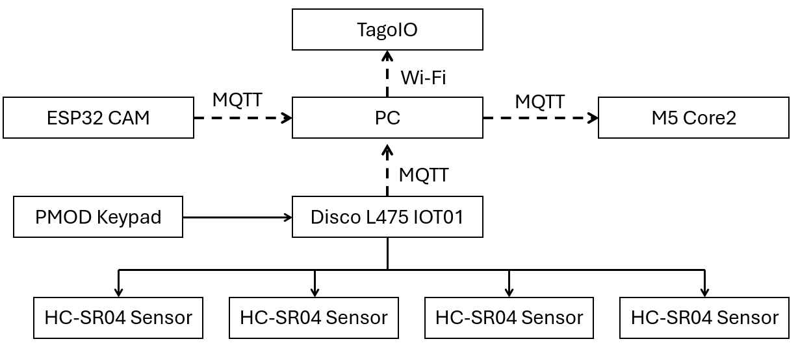
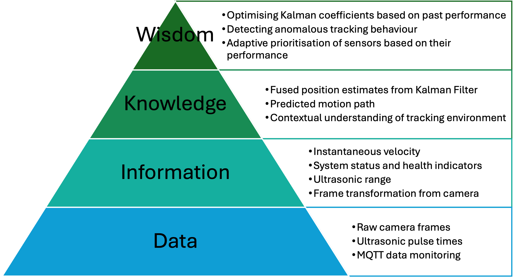
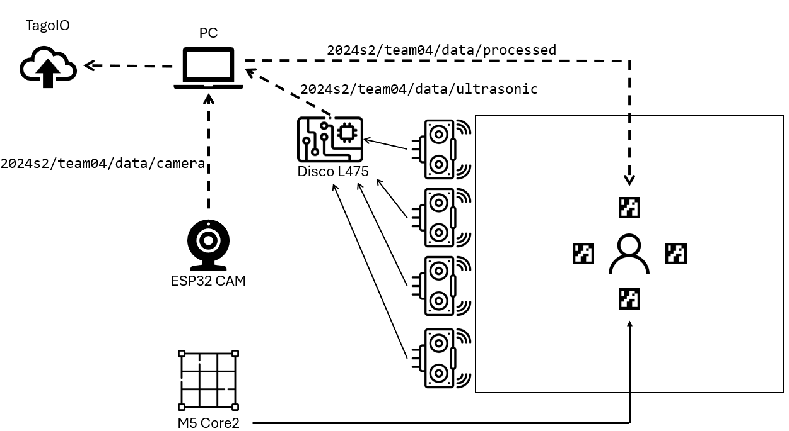

# Milestone Saturn-Cyan

## Project Title
- Computer Vision Enhanced Indoor Localization System with Sensor Fusion

## Team Member List and Roles

1. **Matthew Wynne** will be responsible for the Camera Node that does camera localisation with the ESP32-Cam. Specifically camera calibration, detecting Aruco markers, calculating a frame transformation using the Aruco markers. This is essential for the localisation functionality. He will also be responsible for creating the Tago Web Dashboard.
2. **Carl Flottmann** will be responsible for having all the hardware communicate via MQTT WiFi protocol, which is essential for the wireless communication requirement. This will involve monitoring the WiFi data that is being sent and received, and making a Zephyr driver that enables WiFi, creates data packets and processes data packets. He will also be responsible for the Visualisation node of the M5Core2 that displays the grid.
3. **Tanvi Parulekar** will be responsible for making the Ultrasonic node which calculates ultrasonic range and sends x and y coordinate estimates, as well as processing the data from the ultrasonic sensor array. She will also be responsible for the PMOD keypad functionality to enable/disable ultrasonic sensors with keys, and the Kalman Filter implementation.

## Project Overview

### updates
1. The zephyr implementation of the ESP32-cam was scrapped due to a lack of zephyr support for it. It has been replaced with an m5 core 2 running zephyr, communicating over UART to the ESP32-cam which now runs freeRTOS allowing it to utilise the ESP-IDF. In order to re-integrate the complexity, a custom UART protocol was created and the touchscreen of the Core was used to alllow the setting of the camera parameters (saturation, contrast, quality and brightness). The Core utilised TFTP for the jpegs it receives.

### Project Description
Saturn-Cyan is a localisation system that works by combining data from multiple ultrasonic rangers and an ESP32-CAM. It will consist of a camera node, ultrasonic node, visualisation node, and PC software. A linear array of ultrasonic sensors should be used for accurate distance data, actuated by a PMOD keypad. The camera should be used from a different angle, sending camera data to the PC software. The PC software can then identify ArUco markers the person holds, allowing data fusions with the sensors as well as new rotation data. The person should be able to visualise themselves on the M5Core2 as the system communicates reliably via MQTT.

### Project Block Diagram


## DIKW Pyramid Abstraction


### System Integration
#### Sensor Integration Details
1. **Ultrasonic sensors**
    - **Configured** in a line of 4 sensors at fixed positions.
    - **Data** is distance packets sent in centimeters.
    - **control** interface through 4x4 PMOD keypad.
    - **integration** done through measuring timing between a trigger and echo pin.

2. **ESP32-CAM**
    - **Configured** at a fixed position with known orientation relative to the ultrasonic array.
    - **Data** is a bitstreamn of images
    - **Integration** ESP32 microcontroller with an onboard camera and Wi-Fi functionality

### Wireless Network Communication
1. **Protocol: MQTT over WiFi**
   - Camera nodes → PC via MQTT (channel `2024s2/team04/data/camera`): Vision coordinates
   - Ultrasonic nodes → Disco: Range data
   - Disco -> PC via MQTT (channel `2024s2/team04/data/ultrasonic`): Range data
   - PC -> M5Core2 (channel `2024s2/team04/data/processed`): GUI information
2. **Message Protocol:**
   - Standardized JSON format for all messages
   - Required fields: timestamp, node_id, data_type, payload, sequence_number
3. **Network Topology:**
   - Star topology with MQTT broker (Mosquitto) at center
   - All nodes connect to broker over WiFi
   - Fallback to direct node-to-node communication if broker unavailable




### Deliverables and Key Performance Indicators

1. **Tracking Accuracy KPI:**
   - Position error < 15cm in areas with both camera and ultrasonic coverage
   - Position error < 30cm in areas with only camera coverage
   - Position error < 10cm in areas with only ultrasonic coverage
   - Measured by comparing system estimate with ground truth measurements

2. **System Reliability KPI:**
   - Continuous tracking without loss for ≥ 5 minutes
   - Recovery from temporary occlusion within 1 second
   - Measured by tracking success rate during testing scenarios

3. **Data Fusion Performance KPI:**
   - Demonstrable improvement in accuracy (>20%) compared to single-sensor methods
   - Measured by comparing fused position to camera-only and ultrasonic-only estimates

4. **Latency KPI:**
   - End-to-end latency < 500ms from measurement to dashboard update
   - Measured using timestamps in system logs

5. **Visualization Quality KPI:**
   - Dashboard updates at ≥ 5 FPS
   - All system metrics visible and updating in real-time
   - Measured by the render time per frame (ms)
### Project Management

#### Task Allocation and Timeline

```
Week 1:
- Get hardware component
- ESP-32 Cam
- PMOD keypad
- MQTT
Week 2:
- Adapt Kalman filter & Ultrasonic node from Prac 3
- Test in arena & fine-tune
- M5Core2 Display
- Tago Web Dashboard
- Project presentation slides
```
